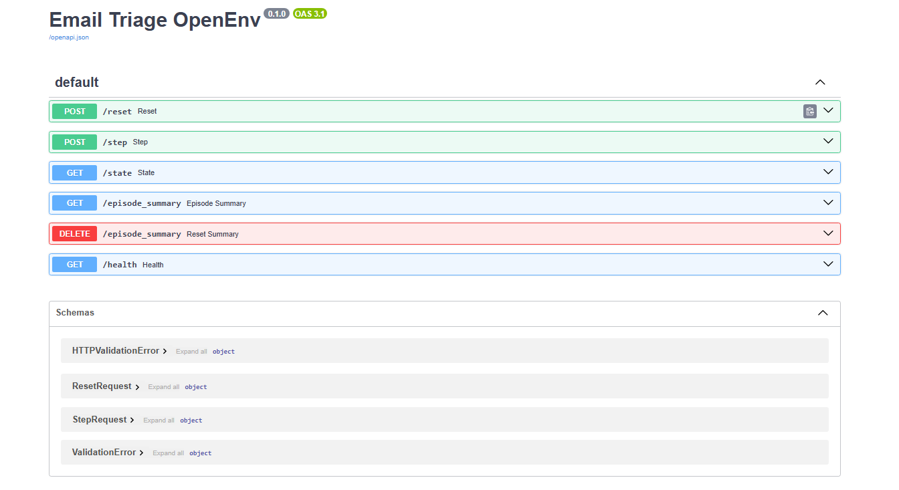

# 📧 Email Triage OpenEnv Environment

An OpenEnv-compliant environment where an AI agent learns to triage emails
by categorizing, prioritizing, analyzing senders, and drafting replies.

## 🎯 Why This Environment?

Email triage is a task every knowledge worker does daily. Training agents
to handle it well has immediate real-world value for productivity tools,
enterprise automation, and AI assistants.

## 🖼️ Live API Preview



## 📐 Observation Space

| Field    | Type   | Description                     |
|----------|--------|---------------------------------|
| email_id | string | Unique identifier for the email |
| subject  | string | Email subject line              |
| body     | string | Email body text                 |
| sender   | string | Sender's email address          |
| task     | string | Active task name                |

## 🎮 Action Space

| Field         | Type    | Values                                   |
|---------------|---------|------------------------------------------|
| category      | string  | urgent, normal, spam                     |
| priority      | integer | 1 (highest) to 5 (lowest)               |
| action        | string  | reply, archive, delete, escalate         |
| sender_type   | string  | internal, external, unknown              |
| reply_subject | string  | Reply subject line or empty string       |

## 📋 Tasks

| Task            | Difficulty | Description                                              |
|-----------------|------------|----------------------------------------------------------|
| categorize      | Easy       | Classify email as urgent / normal / spam                 |
| prioritize      | Medium     | Classify + assign priority 1-5                           |
| full_triage     | Hard       | Classify + prioritize + choose correct action            |
| sender_analysis | Medium     | Classify + identify sender as internal or external       |
| reply_drafting  | Hard       | Classify + prioritize + draft reply subject line         |

## 🏆 Reward Function

All scores are strictly between 0.15 and 0.85 to ensure meaningful signal.

- **categorize**: category accuracy (correct=0.85, wrong=0.15)
- **prioritize**: category (50%) + priority distance score (50%)
- **full_triage**: category (40%) + priority (30%) + action (30%)
- **sender_analysis**: category (50%) + sender type accuracy (50%)
- **reply_drafting**: category (40%) + priority (30%) + reply subject quality (30%)

Priority scoring gives partial credit: -0.15 per level away from correct answer.

## 🚀 Setup & Usage

### Run locally with Docker
```bash
docker build -t email-triage-env .
docker run -p 7860:7860 email-triage-env
```

### Run inference script
```bash
export HF_TOKEN=your_token_here
export MODEL_NAME=Qwen/Qwen2.5-72B-Instruct
export API_BASE_URL=https://router.huggingface.co/v1
export ENV_BASE_URL=https://archit072003-email-triage-env.hf.space
python inference.py
```

## 📊 Baseline Scores

| Task            | Model                | Score |
|-----------------|----------------------|-------|
| categorize      | Qwen2.5-72B-Instruct | 0.85  |
| prioritize      | Qwen2.5-72B-Instruct | 0.77  |
| full_triage     | Qwen2.5-72B-Instruct | 0.81  |
| sender_analysis | Qwen2.5-72B-Instruct | 0.50  |
| reply_drafting  | Qwen2.5-72B-Instruct | 0.60  |

## 📁 Project Structure

```
email-triage-env/
├── email_triage_env.py   # Core environment logic
├── server.py             # FastAPI server
├── server/app.py         # OpenEnv server entry point
├── inference.py          # Baseline inference script
├── openenv.yaml          # OpenEnv spec metadata
├── Dockerfile            # Container configuration
├── requirements.txt      # Python dependencies
└── README.md             # This file
```